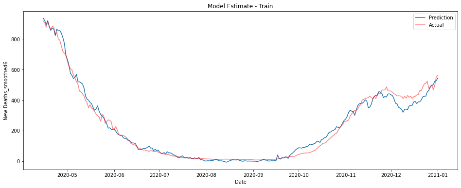

<h1> A Year of Covid </h1>

With Lunar New Years celebrations out of the way we're about a year from the point where Covid-19 really started to come to the attention of the general public, at least here in the UK. With that in mind I would like to ask, and hopefully answer some questions about the pandemic.

 1. Which countries have suffered the worst Covid outbreaks?
 2. Is there a correlation between population density and severity of the outbreaks?
 3.  Is there a good linear model that predicts death rates from ICU patient and case numbers?

With the first two questions we'll be exploring which countries have been most impacted and testing a hypothesis as to why. The final question will focus on finding a model for Covid deaths, models like this can serve as tools for prediction but also for understanding the relationship between things like case numbers and death counts.

<h2>Q1: Which countries have suffered the worst Covid outbreaks?</h2>
A good place to start, when looking back on the last year, is to ask where has been most affected. In particular we'd like to find out which countries have the highest death/case counts proportionate to their population. Using data collected by [Our World in Data](https://ourworldindata.org/) it's easy enough to determine the answer.

 

<table border="1" class="dataframe">
  <thead>
    <tr style="text-align: right;">
      <th></th>
      <th>Country</th>
      <th>Deaths per million</th>
    </tr>
  </thead>
  <tbody>
    <tr>
      <th>1</th>
      <td>San Marino</td>
      <td>1974.188</td>
    </tr>
    <tr>
      <th>2</th>
      <td>Belgium</td>
      <td>1822.666</td>
    </tr>
    <tr>
      <th>3</th>
      <td>Slovenia</td>
      <td>1694.139</td>
    </tr>
    <tr>
      <th>4</th>
      <td>United Kingdom</td>
      <td>1572.843</td>
    </tr>
    <tr>
      <th>5</th>
      <td>Czechia</td>
      <td>1530.678</td>
    </tr>
    <tr>
      <th>6</th>
      <td>Italy</td>
      <td>1469.440</td>
    </tr>
    <tr>
      <th>7</th>
      <td>Bosnia and Herzegovina</td>
      <td>1439.886</td>
    </tr>
    <tr>
      <th>8</th>
      <td>North Macedonia</td>
      <td>1375.649</td>
    </tr>
    <tr>
      <th>9</th>
      <td>Liechtenstein</td>
      <td>1363.505</td>
    </tr>
    <tr>
      <th>10</th>
      <td>United States</td>
      <td>1339.430</td>
    </tr>
  </tbody>
</table>

The ten worst outbreaks, as measured by deaths, consist almost entirely of European Countries. The exception being of course the United States coming in at number 10. 

<table border="1" class="dataframe">
  <thead>
    <tr style="text-align: right;">
      <th></th>
      <th>Country</th>
      <th>Cases per million</th>
    </tr>
  </thead>
  <tbody>
    <tr>
      <th>1</th>
      <td>Andorra</td>
      <td>129062.318</td>
    </tr>
    <tr>
      <th>2</th>
      <td>Montenegro</td>
      <td>98671.787</td>
    </tr>
    <tr>
      <th>3</th>
      <td>Czechia</td>
      <td>92196.345</td>
    </tr>
    <tr>
      <th>4</th>
      <td>San Marino</td>
      <td>89133.125</td>
    </tr>
    <tr>
      <th>5</th>
      <td>Luxembourg</td>
      <td>81046.238</td>
    </tr>
    <tr>
      <th>6</th>
      <td>Slovenia</td>
      <td>80250.821</td>
    </tr>
    <tr>
      <th>7</th>
      <td>United States</td>
      <td>79519.364</td>
    </tr>
    <tr>
      <th>8</th>
      <td>Israel</td>
      <td>75355.891</td>
    </tr>
    <tr>
      <th>9</th>
      <td>Panama</td>
      <td>74419.528</td>
    </tr>
    <tr>
      <th>10</th>
      <td>Portugal</td>
      <td>71230.938</td>
    </tr>
  </tbody>
</table>

The countries with the most cases per million are a little less dominated by European Countries. Somewhat surprisingly only 4 countries appear on both lists. This could be a consequence of understated case counts in countries overwhelmed by the disease, or there might be an underlying epidemiological cause such variations in population demographics making some countries more vulnerable.

<h2>Q2: Is there a correlation between population density and outbreak severity?</h2>
Once again we'll consider both total cases and total deaths as possible measures of outbreak severity. For this question we'll focus mainly on Europe, since this block is heavily affected and the countries inside are relatively similar, making for more meaningful comparisons. Plus there is good quality data on population density.

There are also two main measures of population density we might use. The first is the usual. $$Density=\frac{Population}{Area}$$

Alternatively we can use population weighted density. In principle for a country with population $X$ we have

$$\text{PWD}(d,X) = \frac{1}{|X|}\sum_{p \in X}N(p,d)$$
where $N(p,d)$ is the number of people living within $d$ of $p$. In practice this number is not computable, but we can break a country up into a set of pixels P_{i} of fixed area $a$, density $d_{i}$ and population $p_{i}$. Then 

$$\text{APWD}(a, X) =\frac{\sum_{P_{i}} d_{i}p_{i}}{\sum p_{i}} $$
gives an approximate measure, though it depends on our choice of pixels. We will take the population weighted density to be given by $AWD(1,X)$. 

To test correlation we will, sticking with the theme of 2, consider both the Pearson Coefficient and Spearman Rank. Loosely the first of these will test whether there is a linear correlation, which you might think of as meaning the data is well explained by its line of best fit.

The second, Spearman Rank, is distribution agnostic and tests whether one variable goes up as the other does. Both are given as a score between 1 and -1, with these end scores representing a 'perfect'  positive and negetive correlation respectively. A score of 0 means there is no statistical relationship. 
    

    

If we plot total cases per million vs population density then there does seem to be something of a correlation. The line of best clearly doesn't give a good description of the relationship, so the Pearson Coefficient will be low. However we would expect a Spearman Rank calculation to find a modest correlation.

    

    

Very surprisingly, to me at least. There appears to be little relationship at all - the line of best fit is basically flat, and it is a poor desciptor besides. 

<table border="1" class="dataframe">
  <thead>
    <tr style="text-align: right;">
      <th></th>
      <th>Total Deaths Per Million-Pearson</th>
      <th>Total Cases Per Million-Pearson</th>
      <th>Total Deaths Per Million-Spearman</th>
      <th>Total Cases Per Million-Spearman</th>
    </tr>
  </thead>
  <tbody>
    <tr>
      <th>Population Density</th>
      <td>-0.036615</td>
      <td>0.064073</td>
      <td>0.186325</td>
      <td>0.321026</td>
    </tr>
    <tr>
      <th>Population Weighted Density</th>
      <td>0.099298</td>
      <td>-0.059566</td>
      <td>0.207521</td>
      <td>0.018803</td>
    </tr>
  </tbody>
</table>

The correlation calculations backup the graphical observations. Neither measure of density has a strong linear correlation with deaths or cases. On the other hand the Spearman's rank calculations tell us there is some degree of correlation, with the strongest being between Total Cases and Population Density.

<h2>Q3: Is there good linear model which predicts deaths based upon case and/or ICU patient numbers?</h2>

Many commentators have given a variety of rules of thumb for estimate death rates 1/2 weeks in advance. Intuitively we would expect some essentially fixed proportion of ICU patients/Covid cases not to survive, so some kind of linear model is a good candidate. Indeed all the estimates I have seen given are of this form. To investigate whether we can find good models of this form, I'm going to focus only on the United Kingdom - chosen for having the dubious honour of being where I live. There's also, sadly, a bit more data to work with here than say Australia.

There are of course complicating factors, most noticeably noise introduced to cases and deaths by periodic reporting cycles and that the new cases reported are not always a good estimate of the actual number of cases in the population. 

If we look at the graphs of the data it does look like there is some kind of time lagged relationship between cases, ICU patients and deaths. The deaths and cases numbers are extremely noisy however, whereas the ICU patients curve is much  smoother. This is all pretty much what we'd expected.

If we try to predict deaths from case numbers alone the results are poor, using linear regression anyway. If you don't want to take my word for it you can check out my Github repo. There's an example model computed, and you can change the parameters or use the Pipe function to experiment with others.

ICU patients work much better for forecasting. Unsurprisingly however they don't really pick up the noise in the reported deaths, this is as much as feature as a bug. To combat this we can smooth out the deaths by replacing the daily death count with the 7 day trailing average.

The graphs below show a linear model trained on ICU patient numbers from 1-3 weeks before the prediction date. The first shows performance on the training data from 2020, the second on unseen data from January 2021. 

    

    

    

    

This model performs fantastically, though there is some underestimation on the training data in the last couple of months of 2020.

It turns out however that this model largely predicts from the most recent sets of ICU figures. This is the pattern no matter the data used - the best estimate of deaths on a given day is essentially given by some fraction of whatever the most recent ICU data is.

The coefficients for the model are depicted in the graph below.  I honestly couldn't tell you why there's a large negative coefficient from patients numbers at -13 days, maybe you have some ideas?
    

 
Perhaps somewhat unsurprisingly while the model does a good job predicting what is essentially the number of deaths over the next week, it does poorly at predicting more than about 10 days in advance.
 
Fortunately, we can construct a model that uses both these features to give pretty good performance. By using both case numbers and ICU patient numbers at once we can predict smoothed deaths reasonably well using only data from 2-3 weeks prior to the prediction date. 

I'll spare you a list of coefficients, but again you can find them in my Github repo if you're so inclined.

    

    

    

    

If you're looking for something simpler in your life and want to predict the deaths a couple of weeks in advance, the following model does a surprisingly good job just using cases and ICU patients 2 weeks prior. Curiously this model outperforms the larger one on the test data, this is conceivably a consequence of overfitting in the earlier model but is most likely chance.

        

    

This model takes just a days worth of data and uses the following coefficient.

<table border="1" class="dataframe">
  <thead>
    <tr style="text-align: right;">
      <th></th>
      <th>DataType</th>
      <th>Days</th>
      <th>Coefficient</th>
    </tr>
  </thead>
  <tbody>
    <tr>
      <th>0</th>
      <td>New Cases</td>
      <td>-13</td>
      <td>0.013331</td>
    </tr>
    <tr>
      <th>1</th>
      <td>ICU Patients</td>
      <td>-13</td>
      <td>0.157938</td>
    </tr>
  </tbody>
</table>

While neither ICU patients nor cases are particularly good predictors of reported deaths at 2 weeks, after smoothing the data, the number of ICU patients can be used to predict deaths in the next week extremely well. Combined they offer a pretty good estimation at 2 weeks, even if you restrict to just a single days worth of data.

We could likely estimate deaths even better if we included a contribution of some kind from the positivity rate to estimate how many cases go unnoticed, it's not clear however exactly how this would be best implemented, especially if we wished to ensure that relationship would be well approximated by some linear function. You're welcome to give it a try yourself though, if you have a couple of hours free.

There's also this period at the end of 2020 where almost all the models underestimate the number of deaths. Why is this?

Do you think a linear model was the right way to go?

Let me know what you think.
